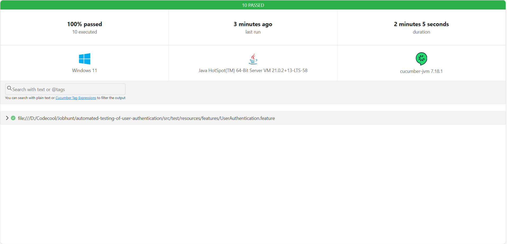

# 🚀 Automated User Authentication Tests

This project contains automated UI tests for validating **User Registration** and **Login** workflows using **Cucumber**, **JUnit**, and **Selenium**.

---

# 🧪 System Under Test (SUT)


## ✅ Features Covered

### 🔐 User Registration

* Successful registration using data from CSV file
* Successful registration with multiple valid credentials
* Failed registration due to invalid data (e.g., missing fields, invalid email)
* Failed registration when using already registered email

### 🔒 User Login

* Successful login after a valid registration
* Unsuccessful login attempt with incorrect password

---

## 📅 Setup Instructions

### 1. Install Java 21

Ensure Java is installed and environment variables are configured:

```bash
set JAVA_HOME="C:\Program Files\Java\jdk-21"
set PATH=%JAVA_HOME%\bin;%PATH%
```

### 2. Install Maven

Check Maven is available:

```bash
mvn -v
```

### 3. Clone the Project

```bash
git clone https://github.com/adesz0112/automated-testing-of-user-authentication
cd automated-testing-of-user-authentication
```

### 4. Build the Project

```bash
mvn clean install
```

---

## ▶️ Running the Tests

You can run tests in multiple ways:

* **Via terminal**:

  ```bash
  mvn clean test
  ```

* **From IDE**:

    * Right-click on:

        * `TestRunnerTest.java` to run all Cucumber scenarios.
        * A specific `.feature` file to run just that one.
        * A `StepDefinition` file to debug or validate individual steps.


# 📈 Test results


After running, open the HTML report at:

```
target/cucumber-reports.html
```

---

## 📂 Project Structure

```
user-auth-tests/
├── src/
│   ├── main/
│   │   └── java/
│   │       ├── model/
│   │       │   └── User.java
│   │       └── pages/
│   │           ├── BasePage.java
│   │           ├── DashboardPage.java
│   │           ├── LoginPage.java
│   │           └── RegistrationPage.java
│   └── test/
│       ├── java/
│       │   ├── StepDefinitions/
│       │   │   ├── Hook.java
│       │   │   ├── LoginStep.java
│       │   │   └── RegistrationStep.java
│       │   ├── Utils/
│       │   │   └── CsvReader.java
│       │   └── TestRunnerTest.java
│       └── resources/
│           ├── features/
│           │   └── UserAuthentication.feature
│           └── testdata/
│               └── test_users.csv
├── pom.xml
└── README.md
```

---

## 📊 Tech Stack

* Java 21
* Maven
* JUnit 5
* Cucumber JVM
* Selenium WebDriver

---

## 👍 Credits

* Designed and tested by: **Ádám Mészáros**

---


